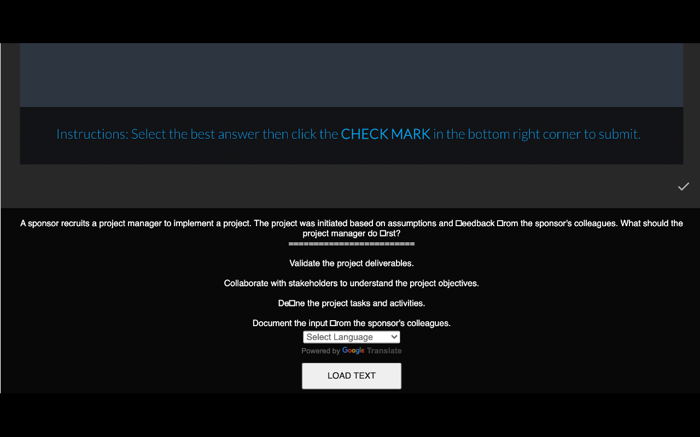

# Project status
| Statistics        |
| ------------- |
|       |
|       |
|       |
|       |
|       |

# What is it?
Translator for the Official PMP Train Exam

Translates PMP Exam into any language you want. Using Google Translate.

Google Translate for PMP Practice Exam. For the page - http://career.lms.pmi.org/Kview/CustomCodeBehind/base/courseware/scorm/*

PMI has their own PMP Exam train solution with 200 questions. Very similar to real exam because based on questions that have asked in previous exams.
https://www.pmi.org/certifications/types/project-management-pmp/earn-the-pmp/pmp-exam-preparation

You can find it on your PMI Account page. For example: http://career.lms.pmi.org/ContentDetails.aspx?id=07816e3e6c464ef983cb7e34af2adae6

This exam train is free, but you need to have PMI membership.

Will works only on pages like http://career.lms.pmi.org/Kview/CustomCodeBehind/base/courseware/scorm/*

# How to install
Google Chrome Extenstions store:
https://chrome.google.com/webstore/detail/pmp-exam-tran-translator/jkpnolnkacalnkhekhglefcknffdkahe

# Screenshots:

